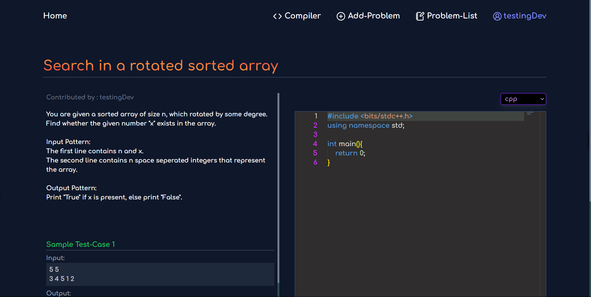

# 🚀 ThinkXCode Online Judge 💻

ThinkXCode Online Judge is a powerful platform for compiling and executing code submissions in multiple programming languages. It offers a seamless interface for users to submit code, test it against various cases, and receive real-time feedback.

---



## 📑 Table of Contents

- [✨ Features](#-features)
- [🛠️ Tech Stack](#-tech-stack)
- [🚀 Getting Started](#-getting-started)
- [📥 Installation](#-installation)
- [⚙️ Usage](#-usage)
- [📞 Contact](#-contact)

---

## ✨ Features

✅ **Multi-language Support** – Supports C++, Python, and JavaScript.  
✅ **Real-time Execution** – Provides instant feedback on code submissions.  
✅ **User Authentication** – Secure user login and registration.  
✅ **Test Case Management** – Create and manage test cases efficiently.  
✅ **Result Evaluation** – Automatic submission evaluation with detailed reports.  
✅ **Responsive UI** – Fully optimized for all devices.  

---

## 🛠️ Tech Stack

**Frontend:** React.js (Hosted on Vercel)  
**Backend:** Node.js, Express.js (Hosted on AWS)  
**Containerization:** Docker  
**Database:** MongoDB  
**Supported Languages:** C++, Python, JavaScript  

---

## 🚀 Getting Started

Follow these steps to set up **ThinkXCode** Online Judge on your local machine.

### 🔧 Prerequisites

- Node.js (v18 or later)  
- Docker  
- MongoDB  

### 📥 Installation

1️⃣ **Clone the repository:**

```sh
git clone https://github.com/D-pixel-crime/Online-Judge.git
cd Online-Judge
```

2️⃣ **Install frontend dependencies:**

```sh
cd frontend
npm install
```

3️⃣ **Install backend dependencies:**

```sh
cd ../backend
npm install
```

4️⃣ **Set up environment variables:**

Create a `.env` file inside the `backend` directory and add:

```plaintext
OJ_FRONTEND_URI = http://localhost:5173
MONGO_URI = your_mongodb_uri
JWT_SECRET = your_jwt_secret
```

5️⃣ **Build and start the Docker containers:**

```sh
cd backend
docker build -t <image_name> .
```

---

## ⚙️ Usage

1️⃣ **Start the frontend:**

```sh
cd frontend
npm run dev
```

2️⃣ **Run the backend server:**

```sh
docker run -it -d -p 3000:3000 <image_name>
```

3️⃣ **Access the application:**

- Frontend: [http://localhost:5173](http://localhost:5173)  
- Backend API: [http://localhost:3000](http://localhost:3000)  

---

## 📞 Contact

📧 Email: [dpk4383@gmail.com](mailto:dpk4383@gmail.com)  
🔗 Project Repository: [GitHub](https://github.com/D-pixel-crime/Online-Judge)  

---

Enjoy coding with **ThinkXCode**! 🚀🔥
